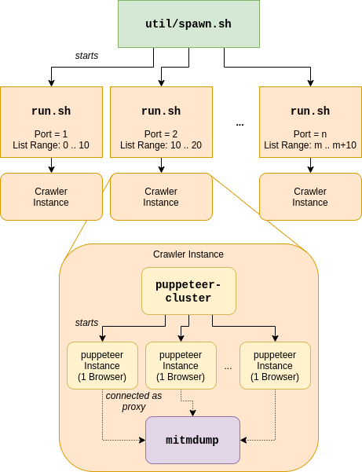

# Crawler

Web Crawler for collecting WebAssembly modules and related JavaScript files. Built using `puppeteer-cluster` and `mitmproxy`.

## Installing Dependencies

`make install` will install the required node modules, download a version of mitmproxy and extract the required binary into `./bin/`.

## Running

Run using `./run.sh`. To see available options, use `./run.sh --help`.
Note that the `mitmdump` processes seem to constantly grow in size ([may be related - mitmdump leaking memory](https://github.com/mitmproxy/mitmproxy/issues/3191#issuecomment-552911587)), so the crawler may need to be restarted regularly.

## Architecture

A single crawler instance consists of one `puppeteer-cluster` process, which
controls the navigation to different web pages (by default, 8 at a time), 
and one `mitmproxy` instance, which intercepts the requests made my puppeteer
and searches for Wasm modules.  
We experienced issues which we suspected to be related to limited throughput
of the python script that evaluates sent requests and responses; Thus, we use `util/spawn.sh` to spawn multiple of these crawler instances at the same time -- see the
image below:

